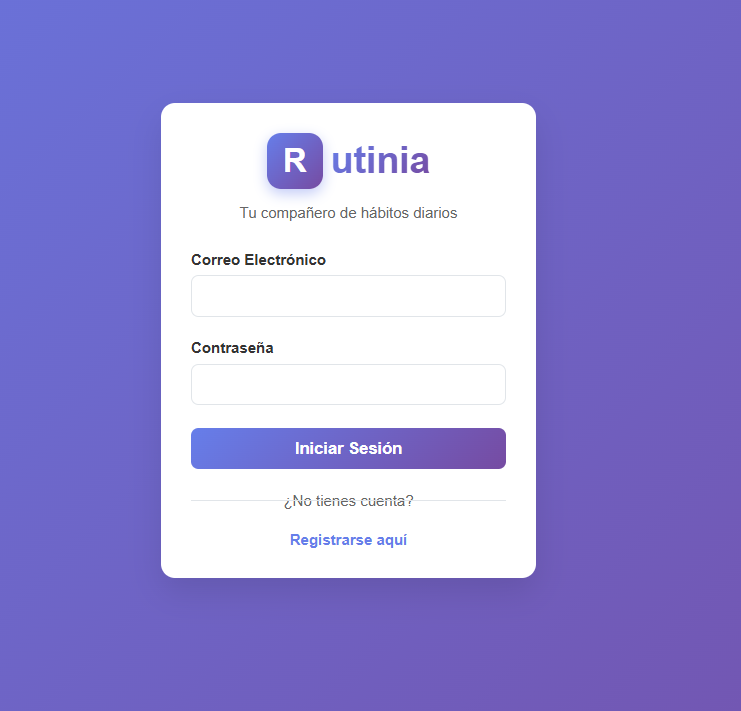
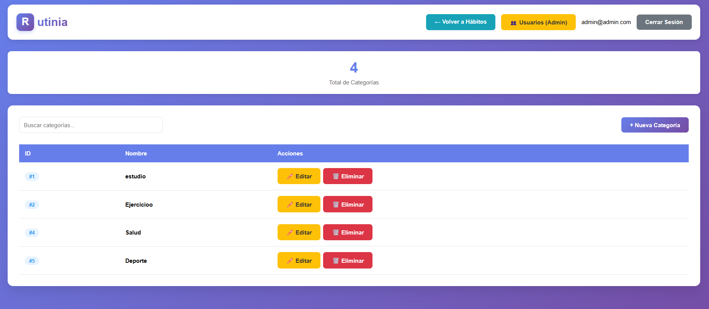
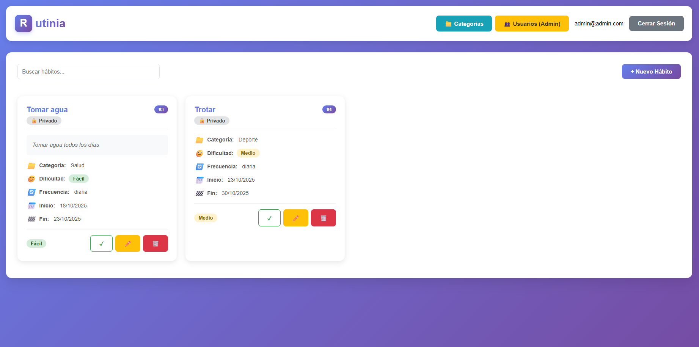
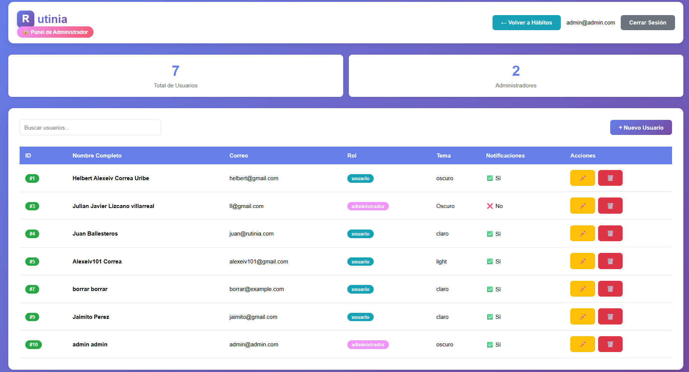

# Rutinia - Gestor de Hábitos

[](https://www.python.org/)
[](https://www.djangoproject.com/)
[](https://reactjs.org/)
[](https://nodejs.org/)
[](https://www.mongodb.com/cloud/atlas)
[](LICENSE)

Aplicación web moderna para la gestión de hábitos, diseñada para ayudar a los usuarios a crear, organizar y seguir sus rutinas de forma intuitiva mediante calendarios interactivos, seguimiento diario y sincronización en la nube.

### Características Principales

- **Gestión Completa de Hábitos** - Crea, edita y elimina hábitos personalizados  
- **Frecuencias Flexibles** - Diaria, semanal o mensual  
- **Calendario Interactivo** - Visualiza tu progreso mes a mes  
- **Seguimiento Diario** - Marca hábitos completados cada día  
- **Personalización** - Elige iconos y colores para cada hábito  
- **Modo Oscuro** - Tema claro y oscuro  
- **Responsive** - Funciona en móvil, tablet y desktop  
- **Nube** - Sincronización automática con MongoDB Atlas  

La documentación completa del proyecto está disponible en la [Wiki](https://github.com/JuanFernandoBallesterosMaciasUIS/Rutinia-1.0/wiki). 

---

## Tabla de Contenidos

- [Instalación y Configuración](#instalación-y-configuración)
  - [Requisitos Previos](#requisitos-previos)
  - [Instalación Paso a Paso](#instalación-paso-a-paso)
    - [Version Django + React](#version-Django-+-react)  
    - [Version Springboot](#version-Springboot) 
  - [Ejecución del Proyecto](#ejecución-del-proyecto)
  - [Solución de Problemas](#solución-de-problemas)
- [Tecnologías Utilizadas](#tecnologías-utilizadas-versión-actual)
- [Estructura del Proyecto](#estructura-del-proyecto-versión-actual)
- [Arquitectura de Datos](#arquitectura-de-datos)
- [Características](#características-versión-actual)
- [Contribución](#contribución)
- [Equipo de Desarrollo](#equipo-de-desarrollo)
- [Contacto y Soporte](#contacto-y-soporte)

---

## Instalación y configuración

### version Django + react

#### Requisitos Previos

Antes de comenzar, asegúrate de tener instalado:

- **Node.js** 20.15.1 o superior - [Descargar](https://nodejs.org/)
- **Python** 3.11 o superior - [Descargar](https://www.python.org/downloads/)
- **Git** - [Descargar](https://git-scm.com/downloads)
- Conexión a Internet (para MongoDB Atlas)

#### Instalación Paso a Paso

##### 1. Clonar el repositorio

```bash
git clone https://github.com/JuanFernandoBallesterosMaciasUIS/Rutinia-1.0.git
cd Rutinia-1.0
```

##### 2. Configurar Backend (Django + MongoDB)

```bash
# Navegar a la carpeta del backend
cd src/backend-django

# Crear entorno virtual
python -m venv venv

# Activar entorno virtual
# Windows PowerShell:
.\venv\Scripts\Activate.ps1
# Windows CMD:
.\venv\Scripts\activate.bat
# Linux/Mac:
source venv/bin/activate

# Instalar dependencias
pip install -r requirements.txt
```

##### 3. Crear Datos de Prueba (Opcional)

```bash
cd rutinia
..\venv\Scripts\python.exe create_sample_habits.py
```

Esto creará:
- 1 usuario de prueba (demo@rutinia.com)
- 1 categoría (Salud)
- 3 hábitos de ejemplo

##### 4. Configurar Frontend (React + Vite)

```bash
# Desde la raíz del proyecto
cd src/frontend-react

# Instalar dependencias
npm install
```

#### Ejecución del Proyecto

##### Opción 1: Script Automático (Windows - Recomendado)

```bash
cd src
.\start-all.bat
```

Este script abre automáticamente:
- Django en `http://localhost:8000`
- React en `http://localhost:5173`

##### Opción 2: Manual (Dos Terminales)

**Terminal 1 - Backend:**
```bash
cd src/backend-django
.\venv\Scripts\Activate.ps1  # Windows
# source venv/bin/activate   # Linux/Mac
cd rutinia
python manage.py runserver
```

**Terminal 2 - Frontend:**
```bash
cd src/frontend-react
npm run dev
```

####  Acceder a la Aplicación

- **Aplicación Web:** `http://localhost:5173`
- **API REST:** `http://localhost:8000/api/`
- **Desde celular (misma WiFi):** Buscar URL "Network" en la terminal de React

#### API Endpoints Principales

| Método | Endpoint | Descripción |
|--------|----------|-------------|
| `GET` | `/api/habitos/` | Listar todos los hábitos |
| `POST` | `/api/habitos/` | Crear nuevo hábito |
| `GET/PUT/DELETE` | `/api/habitos/{id}/` | Ver/Editar/Eliminar hábito |
| `GET/POST` | `/api/categorias/` | Gestionar categorías |
| `GET/POST` | `/api/registros/` | Registros de hábitos completados |

#### Solución de Problemas

**Error: "ModuleNotFoundError: No module named 'django'"**
```bash
cd src/backend-django
.\venv\Scripts\Activate.ps1
pip install -r requeriments.txt
```

**Error: "CORS policy blocked"**
- Verifica que `django-cors-headers` esté instalado
- Confirma que `'corsheaders'` esté en `INSTALLED_APPS` en `settings.py`

**No se muestran hábitos:**
- Verifica que Django esté corriendo: `http://localhost:8000/api/habitos/`
- Revisa la consola del navegador (F12)
- Ejecuta el script de datos de prueba

**Documentación Completa:** Ver [`src/COMO_CORRER_PROYECTO.md`](src/COMO_CORRER_PROYECTO.md)

### version Springboot
##### 1. Clonar el repositorio

```bash
git clone https://github.com/JuanFernandoBallesterosMaciasUIS/Rutinia-1.0.git
cd Rutinia-1.0
```
##### 2. Crear base de datos local

para crear la base de datos se debe usar el script .sql que podra encontrar en

```bash
src/backend-springtboot/rutinia.sql
```
##### 3. Editar application.properties
Debe editar el archivo que se encuentra en `src\backend-springtboot\src\main\resources\application.properties`, cambiando los siguientes parametros con las credenciales de su sesion mySQL

```java
.
.
.
spring.datasource.username=<usuario>
spring.datasource.password=<contraseña>
.
.
.
```

---

## Tecnologías utilizadas (Versión springboot)

### Backend
- Spring Boot 3.5.5 
- Java 17
- JWT
- Spring Security
- Maven
- OpenAPI/Swagger
### Frontend
- HTML5
- CSS3
- JavaScript Vanilla

## Tecnologías utilizadas (Versión Django + react)

### Backend
- **Django** 5.2.7
- **Django REST Framework** 3.16.1
- **MongoEngine** 0.29.1 (MongoDB Atlas)
- **django-cors-headers** 4.9.0

### Frontend
- **React** 19.1.1
- **Vite** 5.4.11
- **Tailwind CSS** 3.4.18
- **Material Icons**
- 
---

## Estructura del proyecto (Versión Actual)

```
Rutinia-1.0/
├── src/
│   ├── backend-django/          # Backend Django + MongoDB
│   │   ├── rutinia/
│   │   │   ├── core/            # App principal (models, views, serializers)
│   │   │   ├── rutinia/         # Configuración (settings.py, urls.py)
│   │   │   ├── manage.py
│   │   │   └── create_sample_habits.py  # Script de datos de prueba
│   │   ├── venv/                # Entorno virtual Python
│   │   └── requeriments.txt
│   │
│   ├── frontend-react/          # Frontend React
│   │   ├── src/
│   │   │   ├── components/      # Componentes React
│   │   │   ├── services/        # API y localStorage
│   │   │   ├── data/
│   │   │   ├── App.jsx
│   │   │   └── main.jsx
│   │   ├── package.json
│   │   └── vite.config.js
│   │
│   ├── backend-springboot/      # Backend Spring Boot (Legacy)
│   │   ├── src/
│   │   │   ├── main/      # Componentes React
│   │   │   |    ├── java/uis/edu/entorno/backend # Area principal (modelos, servicios, repositorios, controladores)
│   │   │   |    ├── java/uis/edu/entorno/resources # (archivos html, css y javascript)
│   ├── start-all.bat            # Script de inicio (Windows)
│   └── COMO_CORRER_PROYECTO.md
│
├── docs/                        # Documentación y diagramas
├── tests/                       # Pruebas
└── README.md
```

---

## Arquitectura de Datos Django + React

### Modelos Principales (MongoDB)

**Usuario**
- nombre, apellido, correo (único)
- clave, tema, rol

**Habito**
- usuario (referencia), categoria (referencia)
- nombre, descripcion, dificultad
- fecha_inicio, tipo_frecuencia, dias[]
- publico, activo, notificaciones[]

**Categoria**
- nombre

**RegistroHabito**
- habito (referencia), fecha, estado

### Almacenamiento Híbrido
- **MongoDB:** Datos de negocio (hábitos, usuarios, registros)
- **localStorage:** Preferencias visuales (iconos, colores)

---

##  Características (Versión Actual)

- Crear y gestionar hábitos personalizados
- Frecuencia: diaria, semanal, mensual
- Marcar hábitos como completados
- Vista de calendario interactivo
- Vista de "Mis Hábitos" con filtros
- Modo oscuro/claro
- Responsive (móvil, tablet, desktop)
- Acceso desde dispositivos en red local
- Sincronización automática con MongoDB
- Categorización de hábitos

---

## Demo y Capturas

### version Springboot







---

## Roadmap

### Versión 1.0 (Actual)
- [x] Migración de Django + MongoDB
- [x] Frontend React con Vite
- [x] CRUD completo de hábitos
- [x] Calendario interactivo
- [x] Modo oscuro/claro
- [x] Responsive design

### Versión 1.1 (Próximamente)
- [ ] Autenticación de usuarios (login/registro)
- [ ] Perfil de usuario
- [ ] Edición de categorías desde UI
- [ ] Estadísticas y gráficos de progreso
- [ ] Sistema de recordatorios

### Versión 2.0 (Futuro)
- [ ] Modo offline con sincronización
- [ ] Exportar datos a PDF/CSV
- [ ] Compartir hábitos con otros usuarios
- [ ] Gamificación (logros, rachas)
- [ ] PWA (Progressive Web App)

---

## Contribución

¡Las contribuciones son bienvenidas! Si deseas colaborar con el proyecto:

### Pasos para contribuir:

1. **Fork** el proyecto
2. **Clona** tu fork: `git clone https://github.com/TU_USUARIO/Rutinia-1.0.git`
3. **Crea una rama** para tu feature: `git checkout -b feature/nueva-funcionalidad`
4. **Realiza tus cambios** siguiendo las convenciones del proyecto
5. **Commit** con mensajes descriptivos: `git commit -m 'feat: agregar funcionalidad X'`
6. **Push** a tu rama: `git push origin feature/nueva-funcionalidad`
7. **Abre un Pull Request** explicando tus cambios

### Convenciones de Commits:

- `feat:` Nueva funcionalidad
- `fix:` Corrección de errores
- `docs:` Cambios en documentación
- `style:` Formateo, espacios, etc.
- `refactor:` Refactorización de código
- `test:` Agregar o modificar tests

> Para más detalles, consulta la sección [Cómo Colaborar](https://github.com/JuanFernandoBallesterosMaciasUIS/Rutinia-1.0/wiki) en la Wiki.

---

## Equipo de Desarrollo

- [Helbert Alexeiv Correa Uribe](https://github.com/Alvoid101) – Product Owner y Equipo de Desarrollo
- [Juan Fernando Ballesteros Macias](https://github.com/JuanFernandoBallesterosMaciasUIS) – Scrum Master y Equipo de Desarrollo
- Camilo Ivan Palacio Perez – Equipo de Desarrollo
- [Julian Javier Lizcano Villarreal](https://github.com/jjlizcano) – Scrum Master y Equipo de Desarrollo
- [Carlos Eduardo Ayala Moreno](https://github.com/Cayalam) – Product Owner y Equipo de Desarrollo
- Harold Esteban Duran Osma – Equipo de Desarrollo

## Contacto y Soporte

- Abre un [Issue](https://github.com/JuanFernandoBallesterosMaciasUIS/Rutinia-1.0/issues) para reportar bugs o solicitar features
- Consulta la [Wiki](https://github.com/JuanFernandoBallesterosMaciasUIS/Rutinia-1.0/wiki) para documentación detallada
- Lee la guía de [Contribución](https://github.com/JuanFernandoBallesterosMaciasUIS/Rutinia-1.0/wiki) antes de hacer Pull Requests

## Estado del Proyecto

**Versión:** 1.0 (Django + React + MongoDB)  
**Última Actualización:** Octubre 2025  
**Estado:** En Desarrollo Activo  
**Contexto:** Proyecto académico - UIS (Universidad Industrial de Santander)

---
